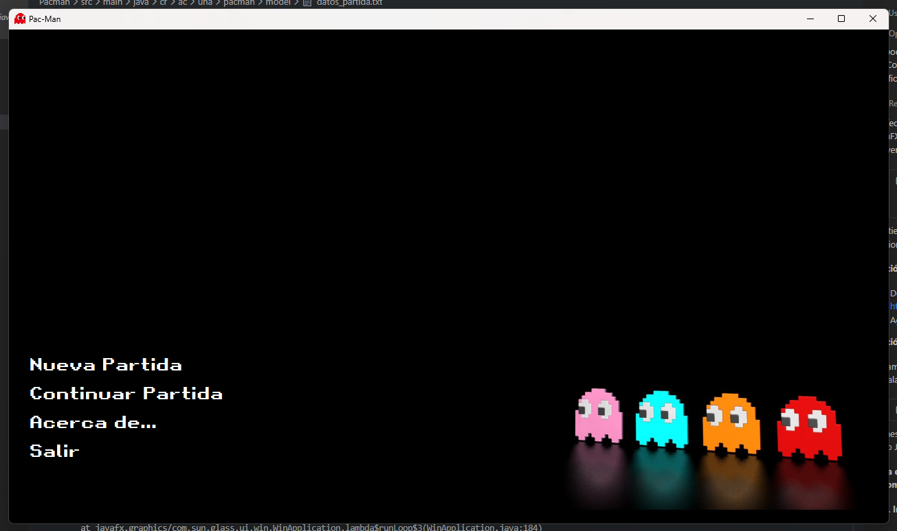
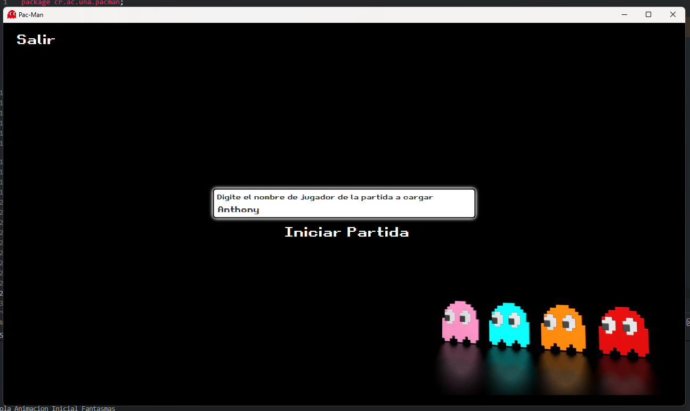
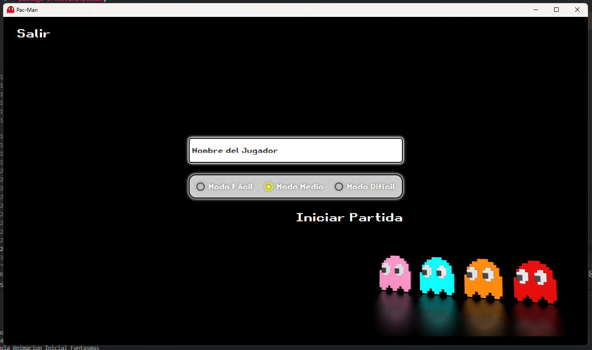
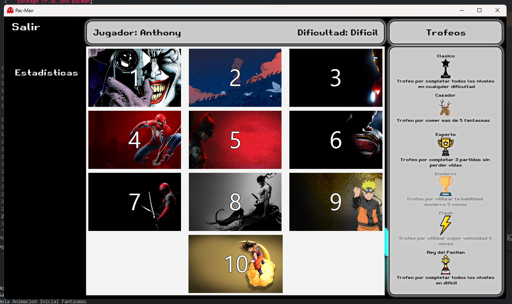
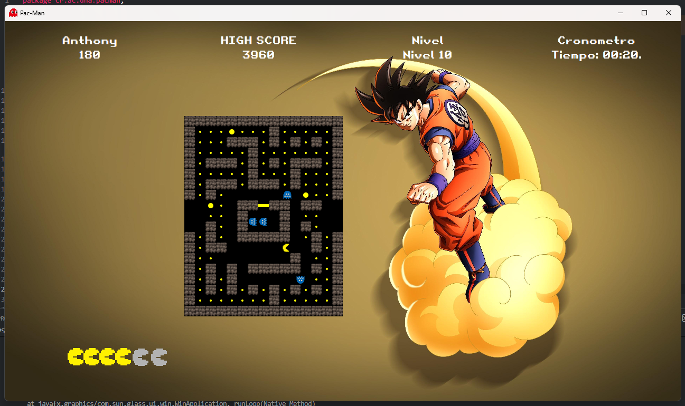
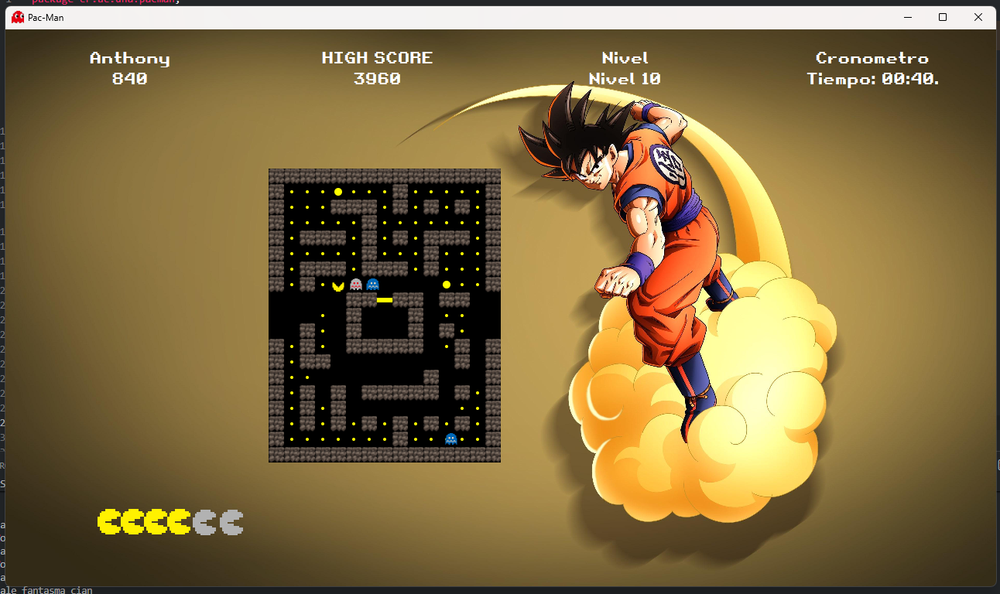
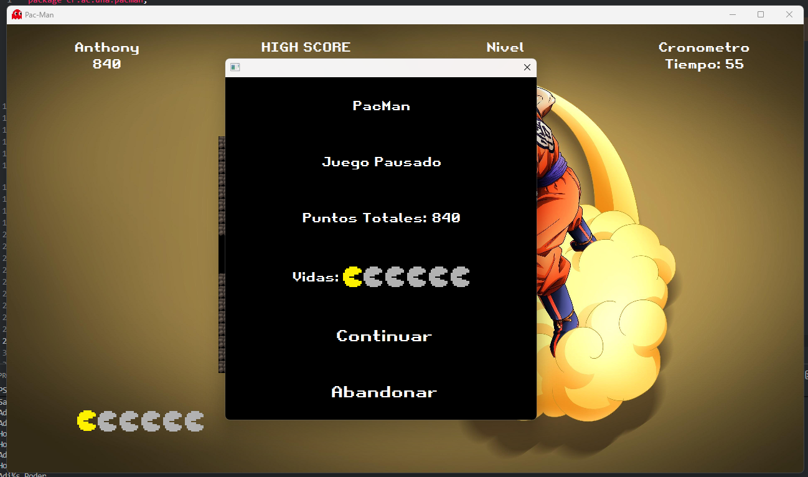
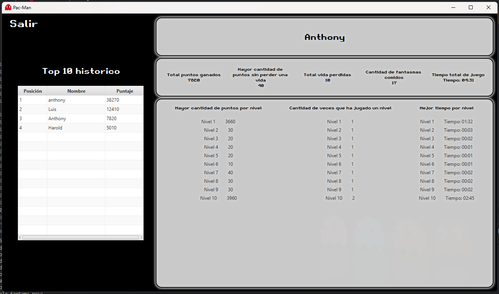

<div align="center">

# Pac-Man Game Project 🎮

*An enhanced version of the classic Pac-Man game with dynamic mazes, unique character behaviors, and exciting power-ups*



</div>

## Table of Contents

- [Overview](#overview)
- [Features](#features)
- [Getting Started](#getting-started)
  - [Prerequisites](#prerequisites)
  - [Installation](#installation)
  - [Running the Game](#running-the-game)
- [Game Screenshots](#game-screenshots)
- [How to Play](#how-to-play)
- [Collaborators](#collaborators)

## Overview

The Pac-Man game project is an implementation of the classic Pac-Man with several enhancements and modifications. The game includes randomly generated mazes, unique behaviors for Pac-Man and ghosts, a scoring system, and various power-ups. Each level features a different theme based on popular characters and franchises.

## Features

- **Dynamic Maze Generation:** Ten levels with randomly generated mazes.
- **Character Behaviors:**
  - Pac-Man: Navigate the maze, collect Pac-Dots, and avoid ghosts.
  - Ghosts:
    - Blinky (Red): Increases speed after Pac-Man consumes a certain number of Pac-Dots.
    - Pinky (Pink): Takes a different route than Blinky, aiding in Pac-Man's pursuit.
    - Inky (Cyan): Acts erratically, making its behavior challenging to predict.
    - Clyde (Orange): Wanders without a specific route.
- **Scoring System:**
  - Earn points for collecting Pac-Dots and special prizes.
  - Points for eating ghosts increase consecutively.
  - Special prizes based on level completion.
- **Power-Ups:**
  - Power Pellets: Temporarily allows Pac-Man to eat ghosts.
  - Enclosure: Sends two randomly selected ghosts back to their home.
  - Super Speed: Doubles Pac-Man's speed for a limited time.
- **Trophies:** Achievements awarded for in-game accomplishments.
- **Difficulty Levels:** Easy, Medium, Difficult, with varying ghost behaviors.
- **Player Statistics:** Tracks various game statistics.
- **Top 10 High Scores:** Persistent record of the best players.

## Getting Started

### Prerequisites

Before running the game, make sure you have the following installed:

- **Java 17.0.2 or higher**
  - Download from [Oracle](https://www.oracle.com/java/technologies/downloads/) or [OpenJDK](https://openjdk.org/)
  - Verify installation: `java -version`

- **Apache Maven**
  - Download from [Maven Official Website](https://maven.apache.org/download.cgi)
  - Add Maven to your system PATH
  - Verify installation: `mvn -version`

- **Java IDE (Optional but recommended)**
  - IntelliJ IDEA
  - Eclipse
  - VS Code with Java Extension Pack

### Installation

1. Clone the repository:
```bash
git clone https://github.com/Anthonyah131/Proyecto-Pac-Man.git
cd Proyecto-Pac-Man/Pacman
```

2. Build the project:
```bash
mvn clean install
```

### Running the Game

Execute the following command in the `Pacman` directory:

```bash
mvn clean javafx:run
```

The game window will open automatically.

## Game Screenshots

<div align="center">

### Main Menu
The main menu allows you to start a new game, continue a saved game, view statistics, and access the about section.


</div>

<div align="center">

### Loading a Game
To continue a previous game, enter the player name you used when you saved your game.



</div>

<div align="center">

### Starting a New Game
When creating a new game, you can choose between three difficulty levels:
- **Easy (Fácil)**: Slower ghosts, more forgiving gameplay
- **Medium (Medio)**: Balanced difficulty
- **Hard (Difícil)**: Fast ghosts, challenging gameplay



</div>

<div align="center">

### Level Selection
Choose from 10 different themed levels, each with unique backgrounds featuring popular characters and franchises.



</div>

<div align="center">

### Gameplay
The classic Pac-Man gameplay with enhanced graphics and smooth animations.


</div>

<div align="center">

### Power-Up Mode
When Pac-Man eats a Power Pellet, ghosts turn blue and vulnerable, allowing you to eat them for extra points!



</div>

<div align="center">

### Eating Ghosts
Score big points by eating vulnerable ghosts. Each consecutive ghost eaten increases your score!



</div>

<div align="center">

### Pause Menu
Press **P** to pause the game at any time. You can continue playing or abandon the current game.



</div>

<div align="center">

### Player Statistics
View detailed statistics including total points, lives lost, ghosts eaten, total playtime, and performance by level.



</div>

<div align="center">

### Trophies
Unlock achievements by completing specific challenges throughout the game.


</div>

## How to Play

### Controls
- **Arrow Keys**: Move Pac-Man (Up, Down, Left, Right)
- **P**: Pause/Resume game
- **ESC**: Return to menu (when paused)

### Objective
- Collect all Pac-Dots in each level to advance
- Avoid ghosts or eat them when powered up
- Collect power-ups for special abilities
- Complete all 10 levels to win the game
- Aim for the high score!

### Game Elements
- **Pac-Dots (Yellow dots)**: Regular points
- **Power Pellets (Large dots)**: Makes ghosts vulnerable
- **Ghosts**: Avoid them or eat them when blue
- **Enclosure Power-Up**: Sends two random ghosts back home
- **Super Speed Power-Up**: Doubles Pac-Man's speed temporarily

## Collaborators

This project was developed by:

- [**Anthony Avila**](https://github.com/Anthonyah131) - Developer
- [**Luis Vargas**](https://github.com/Luvara) - Developer
- [**Kevin Arauz**](https://github.com/kjarj54) - Developer

## License

This project is an educational implementation of Pac-Man. All character designs and game concepts are property of their respective owners.

